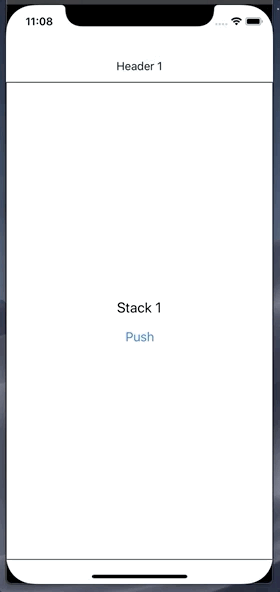

# react-native-navigation-library

A composable, flexible, and declarative API for your app's navigation.

The primitives in this library (try to) stay out of your way as much as possible and lay more responsibility on the user (you). There's only a few core components and a few basic behaviours to grasp, so the code you write is focused more on what you care about and are familiar with: your components. It's super composable, so nesting your navigators and mapping out your app is relatively straightforward.

Sound good? Let's look at some examples:

<p align="center">
  
  
</p>

<p align="center">
  <em>These aren't going to win any design awards, but hopefully you get the idea.</em>
</p>

# Install

`npm install --save react-native-navigation-library`

# Navigation Components

### Tabs

Here's what a basic tab navigator might look like:

```
import { Navigator, Tabs, TabBar, Tab } from 'react-native-navigation-library'

<Navigator>
  <Tabs>
    <MyScreen title="Screen 1" />
    <MyScreen title="Screen 2" />
    <MyScreen title="Screen 3" />
  </Tabs>

  <TabBar>
    <Tab>
      <MyTab title="Tab 1" />
    </Tab>
    <Tab>
      <MyTab title="Tab 2" />
    </Tab>
    <Tab>
      <MyTab title="Tab 3" />
    </Tab>
  </TabBar>
</Navigator>
```

<p align="center">
  
</p>

_Behaviour:_ Children are mounted in the order in which they become active, meaning navigating from Screen 1 to Screen 3 will not mount Screen 2. Note that the TabBar is optional -- you can navigate with your screen components using the `navigation` prop as well (more on this later)

### Stack

...and here's a stack navigator:

```
import { Navigator, Header, Stack } from 'react-native-navigation-library'

<Navigator>
  <Header>
    <MyHeader title="Header 1" />
    <MyHeader title="Header 2" />
    <MyHeader title="Header 3" />
  </Header>

  <Stack>
    <MyScreen title="Stack 1"  />
    <MyScreen title="Stack 2" />
    <MyResetScreen title="Stack 3"/>
  </Stack>
</Navigator>
```

<p align="center">
  
</p>

_Behaviour:_ Children are mounted in order, up until the active child. Navigating to Screen 3 will also mount Screen 1 and 2. This might be useful when the sequence of children is important.

### Switch

```
import { Navigator, Switch } from 'react-native-navigation-library'

<Navigator>
  <Switch>
    <MyScreen title="Switch 1" />
    <MyScreen title="Switch 2" />
    <MyScreen title="Switch 3" />
    <MyResetScreen title="Switch 4" />
  </Switch>
</Navigator>
```

<p align="center">
  
</p>

_Behaviour:_ Only the active child is mounted, previous children are unmounted.

That's about it! Note that each of the accessory components in the examples above (Header, TabBar, Tab, Modal, etc) are composable, meaning you can mix and match and render in any combination that you'd like, depending on your needed use case.

# Navigation prop

Navigating around is (hopefully) fairly similar to what you're used to:

```
navigation: Navigation {
  push: (data: any) => void
  pop: (data: any) => void
  select: (index: number, data: any) => void
  navigate: (routeName: string, data: any) => void
  reset: () => void,
  state: {}: any,
  modal: {
    visible: boolean,
    show: (data: any) => void,
    dismiss: (data: any) => void,
  }
  parent?: (navigation: Navigation)
}
```

The navigation prop is passed to children of `<Stack />`, `<Tabs />`, and `<Switch />`, and provides lots of useful stuff for your screens. `<Navigator />` also accepts a render prop if you'd like to be more explicit (see next example).

### Using `navigation.navigate()`

Navigating using route names requires name props for your screens, _or_ an array of screen names passed to the Navigator:

```
import { Navigator, Header, Switch } from 'react-native-navigation-library'
<Navigator screens={['first', 'second', 'third', 'fourth']}>
  {({ navigation }) => {
    return (
      <View style={{ flex: 1 }}>
        <Header>
          <MyHeader title='Screen 1' onPress={() => navigation.navigate('second')} />
          <MyHeader title='Screen 2' onPress={() => navigation.navigate('third')} />
          <MyHeader title='Screen 3' onPress={() => navigation.navigate('fourth')} />
          <MyHeader title='Screen 3' onPress={() => navigation.reset()} />
        </Header>

        <Switch>
          <MyScreen name='first' navigate={() => navigation.navigate('third', { someData: 'hello there' })} />
          <MyScreen name='second' navigate={() => navigation.navigate('fourth')} />
          <MyScreen name='third' navigate={() => navigation.navigate('second')} />
          <MyResetScreen name='fourth' navigate={() => navigation.navigate('first')} reset={() => navigation.reset() />
        </Switch>
      </View>
    )
  }}
</Navigator>
```

# Other Stuff

### Modal

```
import { Navigator, Stack, Modal, Header } from 'react-native-navigation-library'

<Navigator>
  <Header>
    <MyHeader title="Header 1" />
    <MyHeader title="Header 2" />
    <MyHeader title="Header 3" />
  </Header>

  <Stack>
    <MyScreen title="Modal Panel 1" />
    <MyScreen title="Modal Panel 2" />
    <MyScreen title="Modal Panel 3" />
  </Stack>

  <Modal>
    <MyModal title="Modal for Panel 1" />
    <MyModal title="Modal for Panel 2" />
    <MyModal title="Modal for Panel 3" />
  </Modal>
</Navigator>
```

<p align="center">
  
</p>

### Animation and styles

Each of your defined screens are provided default animation and styles out of the box. They can be configured with animation and style props:

```
import { Navigator, Stack } from 'react-native-navigation-library'

<Navigator>
  <Stack>
    <MyScreen
      title="Screen 1"
      animationTransform={animatedValue => {
        return [
          {
            translateY: animatedValue.interpolate({
              inputRange: [0, 1],
              outputRange: [1000, 75],
            }),
          },
        ]
      }}
      animationConfig={{
        timing: Animated.spring,
        stiffness: 100,
        damping: 200,
        mass: 3,
        overshootClamping: true,
        restDisplacementThreshold: 0.01,
        restSpeedThreshold: 0.01,
      }}
      animationConfigIn={{
        stiffness: 200,
      }}
      animationConfigOut={{
        mass: 100,
      }}
    />

    <MiniScreen
      title="A mini screen"
      style={{
        position: 'absolute',
        left: 30,
        right: 30,
        top: 100,
        bottom: 100,
        borderWidth: 1,
      }}
    />
  </Stack>
</Navigator>
```

<p align="center">
  
</p>

### Header

```
import { Header, Navigator, Stack } from 'react-native-navigation-library'

<Navigator>
  {({ navigation }) => {
    return (
      <View style={{ flex: 1 }}>
        <Header hidden={false}>
          <MyHeader title='Header 1" hidden>
          <MyHeader title='Header 2" goBack={() => navigation.pop()} />
        </Header>

        <Stack>
          <MyScreen title='Screen 1 -- I have no header'>
          <MyScreen title='Screen 2'>
          <MyScreen title='Screen 3 -- I have no header'>
          <MyScreen title='Screen 4 -- I have no header'>
        </Stack>
      </View>
    )
  }}
</Navigator>
```

Each header child element is mapped to a screen based on ordering -- so you declare what header component is rendered for each screen. Each child can be toggled with the `hidden` prop.

### Navigator

It's worth noting that any nested `<Navigator />` will expose it's parent navigation inside the navigation prop if you need it.

You can listen for navigation changes via the onNavigationChange callback, and pass some other initial props to a Navigator:

```
class App extends React.Component {
  state = {
    activeIndex: 0,
    navigation: {},
  }

  handleNavigationChange = (updatedNavigation: Navigation) => {
    this.setState({
      activeIndex: updatedNavigation.activeIndex,
      navigation: updatedNavigation.navigation,
    })
  }

  render() {
    return (
      <Navigator
        screens={['hi', 'hey']}
        initialState={{ test: 'value' }}
        initialIndex={1}
        onNavigationChange={this.handleNavigationChange}
        animated={false}
      >
        {({ navigation }) => {
          return (
            <Stack>
              <MyFormScreen title="Hi" onSubmit={(formValues) => navigation.push({ formValues })} />
              <MyScreen title="Hey" formValues={navigation.state.formValues} />
            </Stack>
          )
        }}
      </Navigator>
    )
  }
}
```

You can also turn animations off -- this can be useful if you want a slightly faster development workflow.

# Testing

One strength of this library is that you can write end to end and integration tests

This library uses Animated apis -- if you're testing with jest, you can mock them out in your environment setup file like this:

```
jest.useFakeTimers()

jest.mock('Easing', () => {
  return {
    _bezier: jest.fn(),
    _easing: jest.fn(),
    inOut: jest.fn(),
  }
})

jest.mock('NativeAnimatedHelper')
```

If you're trying to narrow down the active screen, each navigator will expose a testID that you can query for like so: `queryByTestId('{my-navigation-name}-active-screen')` -- this might be useful to snapshot or peek into whats going on as you write your tests.

# WIP

Some features aren't implemented (yet):

- deep linking
- navigating through several layers of navigators
- probably a lot of other stuff I haven't thought of

# Acknowledgements

The inspiration for this API came from watching [Ryan Florence's lectures](https://reach.tech), specifically the lectures he's done on Tabs components. So, thank you Ryan!

Committing to a navigation library can have a large impact on how you architect your app, but this library is pretty small and you can incrementally adopt it, and I hope that you do!

I'm sure I have missed a ton of stuff, so do not hesitate and reach out
