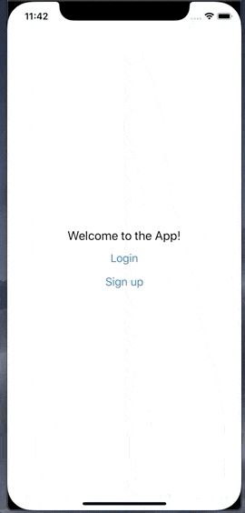
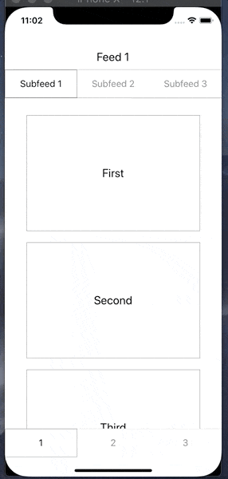
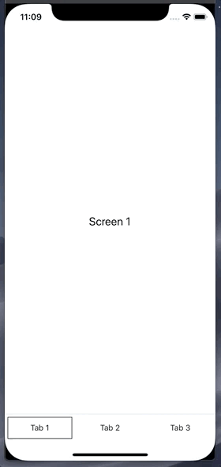
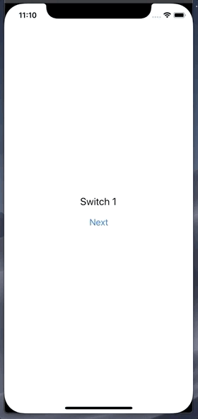
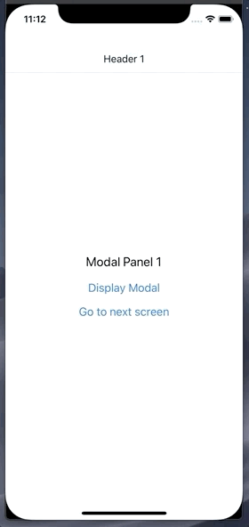

# react-native-navigation-library

A composable, flexible, and declarative API for your app's navigation.

The primitives in this library (try to) stay out of your way as much as possible and lay more responsibility on the user (you). There's only a few core components and a few basic behaviours to grasp, so the code you write is focused more on what you care about and are familiar with: your components. It's super composable, so nesting your navigators and mapping out your app is relatively straightforward.

Sound good? Let's look at some examples:

<p align="center">
  
  
</p>

<p align="center">
  <em>These aren't going to win any design awards, but hopefully you get the idea.</em>
</p>

# Updates - v0.2.0

v0.2.0 introduces updates to the `<Navigator />` required props:

- an array of screen names is required
- if using modals, an array of modal names is required

```
<Navigator
  name="my-navigator"
  screens={['login', 'signup', 'onboarding']}
  modals={['success', 'error']}>
  {...}
</Navigator>
```

# Install

`npm install --save react-native-navigation-library`

# Setup

This library exposes a top level navigation provider that you'll need to wrap around your app:

```
// e.g App.js

import { AppNavigation } from 'react-native-navigation-library'

function App(props) {
  return (
    <AppNavigation location='/my-navigator'>
      {props.children}
    </AppNavigation>
  )
}

```

Deep linking and routing is now setup throughout your app. More on this in the [routing section](#routing)

# Navigation Components

### Tabs

Here's what a basic tab navigator might look like:

```
import { Navigator, Tabs, TabBar, Tab } from 'react-native-navigation-library'

// note: the render prop is optional -- all child screens / header / tabbar components
// will receive the navigation prop implicitly

<Navigator name='my-tabs-navigator' screens={['tab-1', 'tab-2', 'tab-3']}>
  {({ navigation }) => {
    return (
      <View style={{ flex: 1 }}>
        <Tabs>
          <MyScreen title="Tab 1" />
          <MyScreen title="Tab 2" />
          <MyScreen title="Tab 3" />
        </Tabs>

        <TabBar>
          <Tab>
            <MyTab title="Tab 1" />
          </Tab>
          <Tab>
            <MyTab title="Tab 2" />
          </Tab>
          <Tab>
            <MyTab title="Tab 3" />
          </Tab>
        </TabBar>
      </View>
    )
  }}
</Navigator>
```

<p align="center">
  
</p>

### Stack

...and here's a stack navigator:

```
import { Navigator, Header, Stack } from 'react-native-navigation-library'

<Navigator name='my-stack-navigator' screens={['stack-1', 'stack-2', 'stack-3']}>
  {({ navigation }) => {
    return (
      <View style={{ flex: 1 }}>
        <Header>
          <MyHeader title="Header 1" />
          <MyHeader title="Header 2" />
          <MyHeader title="Header 3" />
        </Header>

        <Stack>
          <MyScreen title="Stack 1"  />
          <MyScreen title="Stack 2" />
          <MyResetScreen title="Stack 3"/>
        </Stack>
      </View>
    )
  }}
</Navigator>
```

<p align="center">
  
</p>

### Switch

```
import { Navigator, Switch } from 'react-native-navigation-library'

<Navigator name='my-switch-navigator' screens={['first', 'second', 'third', 'fourth']}>
  <Switch>
    <MyScreen title="Switch 1" />
    <MyScreen title="Switch 2" />
    <MyScreen title="Switch 3" />
    <MyResetScreen title="Switch 4" />
  </Switch>
</Navigator>
```

<p align="center">
  
</p>

<p align="center">
  A switch will only mount one screen component at a time
</p>

### Navigator

You can listen for navigation changes via the onNavigationChange callback, and pass some other initial props to a Navigator:

```
class App extends React.Component {
  state = {
    activeIndex: 0,
    navigation: {},
  }

  handleNavigationChange = (updatedNavigation: Navigation) => {
    this.setState({
      activeIndex: updatedNavigation.activeIndex,
      navigation: updatedNavigation.navigation,
    })
  }

  render() {
    return (
      <Navigator
        name='my-stack-nav'
        screens={['hi', 'hey']}
        initialState={{ test: 'value' }}
        initialIndex={1}
        onNavigationChange={this.handleNavigationChange}
        animated={false}
      >
        {({ navigation, activeIndex, activeScreen }) => {
          return (
            <Stack>
              <MyFormScreen title="Hi" onSubmit={(formValues) => navigation.push({ formValues })} />
              <MyScreen title="Hey" formValues={navigation.state.formValues} />
            </Stack>
          )
        }}
      </Navigator>
    )
  }
}
```

You can also turn animations off -- this can be useful if you want a slightly faster development workflow.

### Modal

```
import { Navigator, Stack, Modal, Header } from 'react-native-navigation-library'

<Navigator
  name="modal"
  screens={['1', '2', '3']}
  modals={['first-modal', 'second-modal', 'third-modal']}>
  {({ navigation }) => {
    return (
      <View style={{ flex: 1 }}>
        <Header>
          <MyHeader title="Header 1" />
          <MyHeader title="Header 2" />
          <MyHeader title="Header 3" />
        </Header>

        <Stack>
          <MyScreen
            title="Modal Panel 1"
            onPress={() =>
              navigation.modal.show('first-modal', { title: 'hello' })
            }
          />
          <MyScreen
            title="Modal Panel 2"
            onPress={() => navigation.modal.show('third-modal')}
          />
          <MyScreen
            title="Modal Panel 3"
            onPress={() => navigation.modal.show('second-modal')}
          />
        </Stack>

        <Modal>
          <MyModal name="first-modal" title={navigation.state.title} />
          <MyModal name="second-modal" title="Modal for Panel 2" />
          <MyModal name="third-modal" title="Modal for Panel 3" />
        </Modal>
      </View>
    )
  }}
</Navigator>
```

<p align="center">
  
</p>

That's about it! Note that each of the accessory components in the examples above (Header, TabBar, Tab, etc) are composable, meaning you can mix and match and render in any combination that you'd like, depending on your needed use case.

# Navigation prop

Navigating around is (hopefully) fairly similar to what you're used to:

```
navigation: Navigation {
  back: () => void  // - return to the previously rendered screen
  pop: (data: any) => void // - navigate to the previous child screen
  push: (data: any) => void // - navigate to the next child screen
  select: (index: number, data: any) => void // navigate to child at index
  navigate: (routeName: string, data: any) => void // navigate to child via screen 'name'
  goTo: (absolutePath: string, data: any) => void // navigate to any child via absolute path
  replaceWith: (absolutePath: string, data: any) => void // navigate to any child and replace current history
  reset: () => void, // reset navigation to its initial state
  state: {}: any, // any object you want to share with your navigator children
  modal: {
    active: boolean,
    show: (name: string, data: any) => void, // toggle modal (on) by name prop
    dismiss: (name: string, data: any) => void, // toggle modal (off) by name prop
  }
}
```

### Using `navigation.navigate()`

```
import { Navigator, Header, Switch, Link } from 'react-native-navigation-library'

<Navigator name='navigate' screens=['first', 'second', 'third', 'fourth']>
  {({ navigation }) => {
    return (
      <View style={{ flex: 1 }}>
        <Header>
          <MyHeader title='Screen 1' onPress={() => navigation.navigate('second')} />
          <MyHeader title='Screen 2' onPress={() => navigation.navigate('third')} />
          <MyHeader title='Screen 3' onPress={() => navigation.navigate('fourth')} />
          <MyHeader title='Screen 3' onPress={() => navigation.reset()} />
        </Header>

        <Switch>
          <MyScreen navigate={() => navigation.navigate('third', { someData: 'hello there' })} />
          <MyScreen navigate={() => navigation.navigate('fourth')} />
          <MyScreen navigate={() => navigation.navigate('second')} />
          <MyResetScreen navigate={() => navigation.navigate('first')} reset={() => navigation.reset() />
        </Switch>

        <Link to='/navigate/second' replace><Text>Go to second</Text></Link>
      </View>
    )
  }}
</Navigator>
```

# Routing

Each navigator defines its routing with an array of screen routes. This way, you can navigate around your app using absolute paths using the `navigation.goTo(absolutePath, data)`, `navigation.replaceWith(absolutePath, data)` or `<Link to={absolutePath} />` component. At the top level, you can initialize your app with a location which makes debugging / setting up your initial view fairly straightforward.

Under the hood, deep linking is also enabled, so opening your app with a deep link should work.

Here's a super basic example:

```
import {
  AppNavigation,
  Link,
  Navigator,
  Switch,
  Tabs,
  TabBar,
  Tab,
  Modal,
} from 'react-native-navigation-library'

function App() {
  return (
    <!-- You can update this location prop in your devtools to easily debug / navigate to the screens you're working on -->
    <AppNavigation location="/entry">

      <!-- Define the names of your screens to setup routing in your <Navigator />'s -->
      <Navigator name="entry" screens={['signup', 'onboarding']}>
        <View>
          <Switch>
            <Navigator name="signup" screens={['signup-form', 'name-form']}>
              <Signup />
            </Navigator>

            <Navigator
              name="onboarding"
              screens={['welcome-tab', 'location-permissions-navigator']}>
              <Onboarding />
            </Navigator>
          </Switch>

          <!-- You can navigate to nested views / nested navigators  -->
          <Link to="/entry/signup/signup-form">
            <Text>Link to second signup page</Text>
          </Link>

          <Link to="/entry/onboarding/location-permissions-navigator">
            <Text>Onboarding Location Screen</Text>
          </Link>
        </View>
      </Navigator>

    </AppNavigation>
  )
}

function Signup(props) {
  const { navigation } = props

  return (
    <View>
      <Header style={{ paddingHorizontal: 20 }}>
        <MyHeader title="Welcome" />
        <MyHeader title={`Hello ${navigation.state.name}!`} />
      </Header>

      <Tabs>
        <MyScreen title='Name Form' />
        <MyScreen title='Signup Form' onSubmit={(formValues) => navigation.modal.show('success', formValues)} />
      </Tabs>

      <Modal>
        <View name='success'>
          <Text>Success!</Text>
          <Link to='/entry/onboarding'><Text>Go to onboarding</Text></Link>
        </View>
      </Modal>
    </View>
  )
}

function Onboarding(props) {
  const { navigation } = props

  return (
    <View>
      <Tabs>
        <MyScreen title='First Screen' />
        <LocationPermissions title='Setup your permissions' />
      </Tabs>

      <TabBar>
        <Tab>
          <MyTab title='1' />
        </Tab>
        <Tab>
          <MyTab title='2' />
        </Tab>
      </TabBar>
    <View>
  )
}
```

# Other Stuff

### Animation and styles

Each of your defined screens are provided default animation and styles out of the box. They can be configured with animation and style props. You can also pass styles and animation configurations to all of the screens in your navigator (see Stack instance below)

```
import { Navigator, Stack } from 'react-native-navigation-library'

<Navigator name="screens" screens=['screen-1', 'screen-2']>
  <Stack>
    <MyScreen
      title="Screen 1"
      style={{ borderWidth: 1 }}
      transition={{
        method: Animated.timing,
        animation: animatedValue => {
          return {
            transform: [
              {
                translateY: animatedValue.interpolate({
                  inputRange: [0, 1],
                  outputRange: [1000, 75],
                }),
              },
            ],
          }
        },
        config: {
          timing: Animated.spring,
          stiffness: 100,
          damping: 200,
          mass: 3,
          overshootClamping: true,
          restDisplacementThreshold: 0.01,
          restSpeedThreshold: 0.01,
        },
        configIn: {
          mass: 100
        },
        configOut: {
          mass: 200
        }
      }}
    />

    <MiniScreen
      style={{
        position: 'absolute',
        left: 30,
        right: 30,
        top: 100,
        bottom: 100,
        borderWidth: 1,
      }}
      title="A mini screen"
    />
  </Stack>
</Navigator>
```

<p align="center">
  
</p>

### Header and TabBar

```
import { Header, Navigator, Stack, TabBar, Tab } from 'react-native-navigation-library'

<Navigator screens=['1', '2', '3', '4']>
  {({ navigation }) => {
    return (
      <View style={{ flex: 1 }}>
        <Header hidden={this.state.tabbarHidden} style={{ height: 100, padding: 20 }}>
          <View hidden> // hides parent header
          <MyHeader title='Header 2" goBack={() => navigation.pop()} />
        </Header>

        <Stack>
          <MyScreen title='Screen 1 -- I have no header'>
          <MyScreen title='Screen 2'>
          <MyScreen title='Screen 3 -- I have no header'>
          <MyScreen title='Screen 4 -- I have no header'>
        </Stack>

        <TabBar hidden={this.state.tabbarHidden} style={{ position: 'absolute', top: 20, left: 0 }}>
          <Tab>
            <MyTab title="Tab 1" /> // MyTab receives 'active' prop
          </Tab>
          <Tab>
            <MyTab title="Tab 2" />
          </Tab>
          <Tab>
            <MyTab title="Tab 3" />
          </Tab>
        </TabBar>
      </View>
    )
  }}
</Navigator>
```

Each header child element is mapped to a screen based on ordering -- so you declare what header component is rendered for each screen. Each child can be toggled with the `hidden` prop.

# Testing

One strength of this library is that you can write end to end and integration tests

This library uses Animated apis -- if you're testing with jest, you might need to mock them out in your setup file:

```
jest.useFakeTimers()

jest.mock('Easing', () => {
  return {
    _bezier: jest.fn(),
    _easing: jest.fn(),
    inOut: jest.fn(),
    out: jest.fn(),
    poly: jest.fn(),
    linear: jest.fn(),
    in: jest.fn(),
  }
})

jest.mock('Animated', () => {
  return {
    View: props => (props.children ? props.children : null),
    Value: jest.fn(() => {
      return {
        interpolate: jest.fn(),
      }
    }),
    spring: jest.fn(() => {
      return {
        start: jest.fn(callback => {
          callback()
        }),
      }
    }),
    timing: jest.fn(() => {
      return {
        start: jest.fn(callback => {
          callback()
        }),
      }
    }),
  }
})

jest.mock('NativeAnimatedHelper')

```

If you're trying to narrow down the active screen, each navigator will expose a testID that you can query for like so: `queryByTestId('{my-navigator-name}-active-screen')` -- this might be useful to snapshot or peek into whats going on as you write your tests.

# Roadmap

Some features aren't implemented (yet):

- ~~deep linking~~
- gesture support
- better examples
- better custom animation support

# Acknowledgements

The inspiration for this API came from watching [Ryan Florence's lectures](https://reach.tech), specifically the lectures he's done on Tabs components. So, thank you Ryan!

Committing to a navigation library can have a large impact on how you architect your app, but this library is pretty small and you can incrementally adopt it, and I hope that you do!

I'm sure I have missed a ton of stuff, so do not hesitate and reach out
